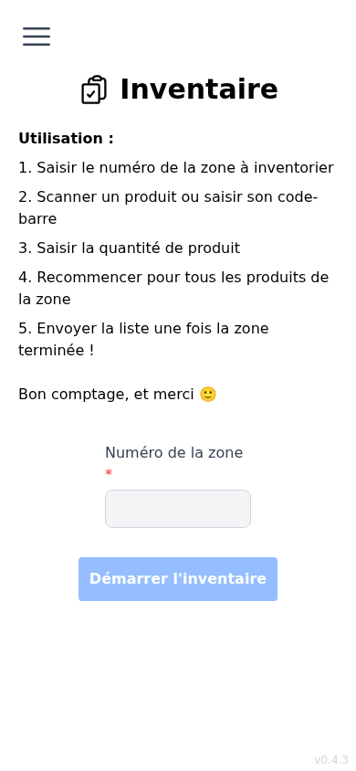
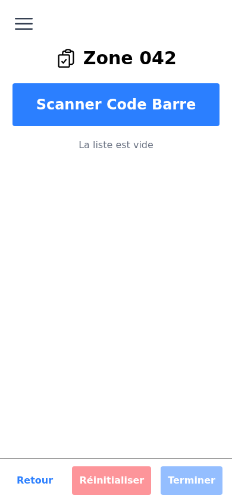
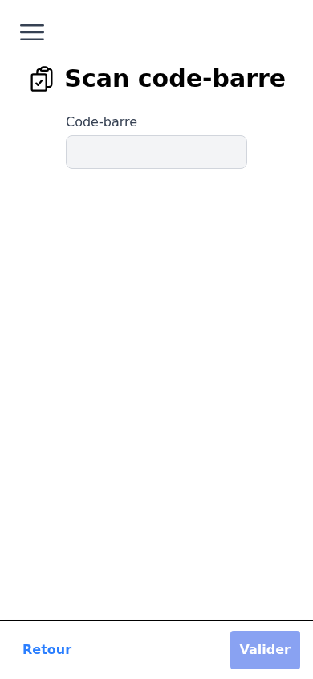
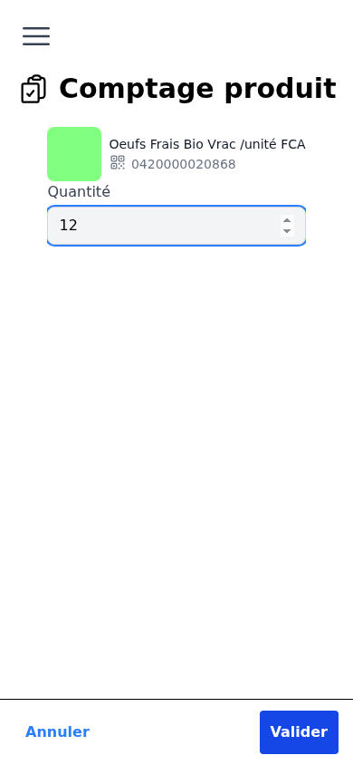
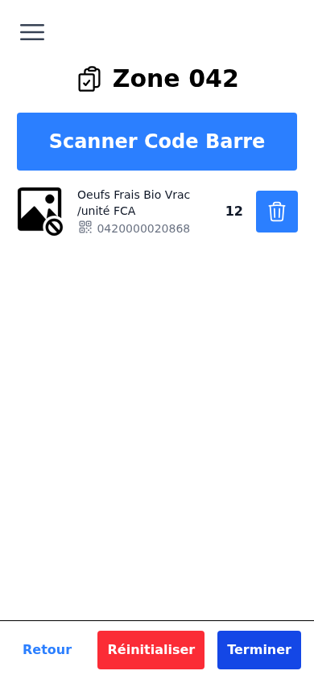
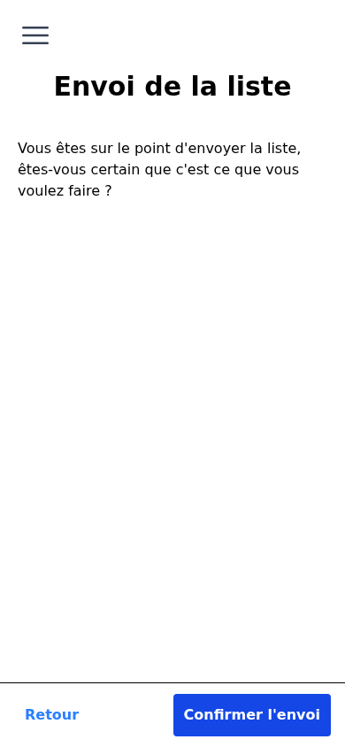

# Guide utilisateur — Inventaire

Ce guide explique comment réaliser un inventaire de zone avec la Supercoop'App.

---

## Vue d'ensemble

L'inventaire se fait zone par zone. Pour chaque zone, vous scannez les produits un à un, saisissez leur quantité, puis envoyez la liste une fois la zone terminée. Deux inventaires indépendants par zone permettent de générer une fiche de soucis.

---

## Étape 1 — Saisir le numéro de zone

Depuis le menu, appuyez sur **Inventaire**.

- Saisissez le **numéro de zone** à 3 chiffres (ex. : `042`).
- Si vous avez déjà commencé cette zone, le bouton indique **Reprendre l'inventaire**.
- Sinon, le bouton indique **Démarrer l'inventaire**.
- Appuyez sur le bouton pour accéder à la liste des produits.

> Le numéro de zone doit être exactement 3 chiffres. Si le bouton reste grisé, vérifiez votre saisie.

---

## Étape 2 — Scanner un produit

Depuis la liste de la zone, appuyez sur **Scanner Code Barre**.

- Pointez l'appareil photo vers le code-barres du produit.
- La détection est automatique.
- Si le scan ne fonctionne pas, appuyez sur **Saisie manuelle** et entrez les 13 chiffres du code-barres.

> Le code-barres doit comporter exactement 13 chiffres. Si votre appareil le supporte, le bouton **torche** (éclair) permet d'activer le flash pour les environnements sombres.

---

## Étape 3 — Saisir la quantité

Après le scan, la fiche du produit s'affiche.

- L'image et le nom du produit apparaissent si le produit est reconnu.
- Saisissez la **quantité** comptée dans la zone.
- Appuyez sur **Valider** pour enregistrer et revenir à la liste.
- Appuyez sur **Annuler** pour revenir sans enregistrer.

> Si le produit n'est pas reconnu, la saisie reste possible. Entrez la quantité normalement.

---

## Étape 4 — Gérer la liste

La liste affiche tous les produits enregistrés pour la zone en cours.

- Pour **ajouter un produit**, appuyez sur **Scanner Code Barre**.
- Pour **supprimer un produit**, appuyez sur l'icône poubelle à droite du produit.
- Pour **vider toute la liste**, appuyez sur **Réinitialiser** (une confirmation est demandée).

---

## Étape 5 — Envoyer l'inventaire

Une fois tous les produits de la zone saisis, appuyez sur **Terminer**.

- Un message de confirmation s'affiche.
- Appuyez sur **Confirmer l'envoi** pour soumettre l'inventaire.
- Un message confirme l'enregistrement :
  - *« Premier inventaire enregistré pour la zone XXX. »*
  - *« Inventaire n°2 enregistré pour la zone XXX. »*
- Si deux inventaires sont disponibles pour la zone : *« La fiche de soucis peut être générée. »*
- Appuyez sur **Retour à l'accueil** pour recommencer avec une nouvelle zone.

---

## Récapitulatif

| Étape | Action |
|---|---|
| 1 | Saisir le numéro de zone (3 chiffres) |
| 2 | Scanner le code-barres ou le saisir manuellement |
| 3 | Entrer la quantité et valider |
| 4 | Répéter pour tous les produits de la zone |
| 5 | Terminer et confirmer l'envoi |
