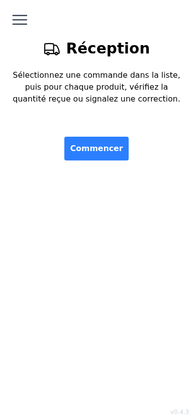
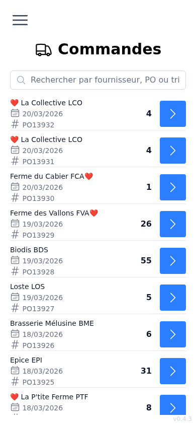
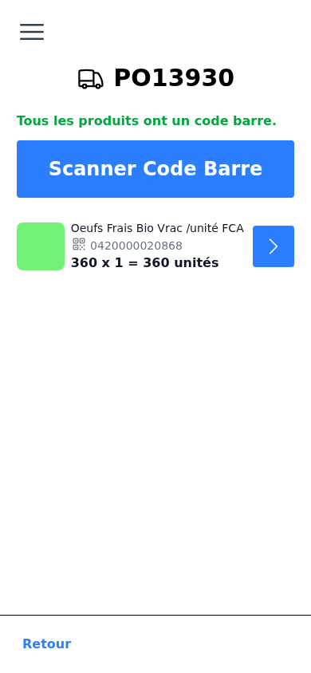
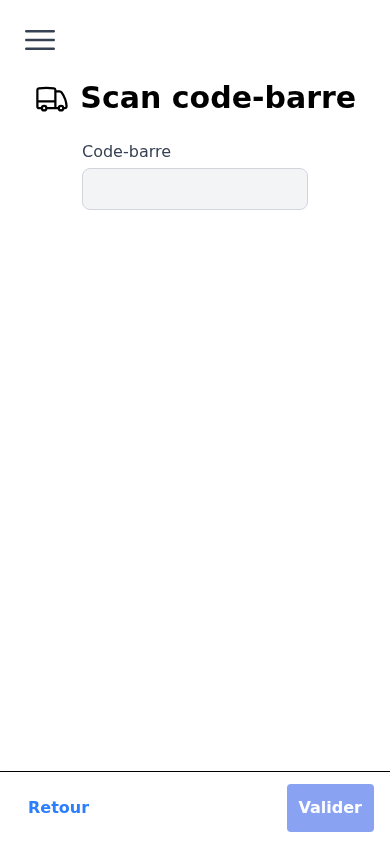
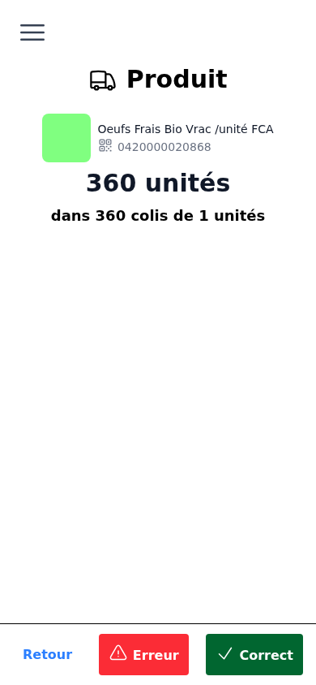

# Guide utilisateur — Réception

Ce guide explique comment traiter une réception de commande avec la Supercoop'App.

---

## Vue d'ensemble

La réception consiste à vérifier les produits livrés par rapport à une commande fournisseur. Pour chaque produit, vous indiquez si la quantité reçue est correcte ou signalez une anomalie. Une fois tous les produits traités, vous envoyez le compte-rendu.

---

## Étape 1 — Accéder aux commandes

Depuis le menu, appuyez sur **Réception**, puis sur **Commencer**.

La liste des commandes en attente de réception s'affiche.

- Utilisez la **barre de recherche** pour filtrer par fournisseur, numéro de commande (PO) ou trigramme.
- Les commandes déjà traitées apparaissent en grisé.
- Appuyez sur la flèche à droite d'une commande pour l'ouvrir.

---

## Étape 2 — Vérifier les produits de la commande

La liste des produits de la commande s'affiche avec pour chaque produit :

- L'image et le nom du produit.
- Le code-barres.
- La quantité attendue (ex. : *360 colis de 1 unité*).
- Le statut de réception (non traité / correct / erreur).

**Si des produits n'ont pas de code-barres :**
> Un avertissement rouge s'affiche avec la liste des produits concernés. Le scan est bloqué jusqu'à ce que la situation soit réglée. Contactez un coordo ou un salarié.

---

## Étape 3 — Scanner un produit

Appuyez sur **Scanner Code Barre**.

- Pointez l'appareil photo vers le code-barres du produit.
- La détection est automatique.
- Si le scan ne fonctionne pas, appuyez sur **Saisie manuelle** et entrez les 13 chiffres du code-barres.

> Si votre appareil le supporte, le bouton **torche** (éclair) permet d'activer le flash pour les environnements sombres.

---

## Étape 4 — Valider ou signaler une anomalie

Après le scan, la fiche du produit s'affiche avec la quantité attendue.

### Réception correcte
Appuyez sur **Correct** (bouton vert) si la quantité reçue correspond à la commande.

### Anomalie (quantité incorrecte, colis manquant…)
Appuyez sur **Erreur** (bouton rouge), puis :

1. Saisissez le **nombre de colis réellement reçus**.
   - L'équivalent en unités se calcule automatiquement.
2. Ajoutez un **commentaire** si nécessaire (facultatif).
3. Appuyez sur **Valider**.

> Vous pouvez revenir modifier le statut d'un produit en appuyant à nouveau dessus dans la liste.

---

## Étape 5 — Envoyer le compte-rendu

Le bouton **Terminer** apparaît dans le pied de page **uniquement quand tous les produits ont été traités** (statut vert ou rouge pour chacun).

- Appuyez sur **Terminer**, puis sur **Confirmer l'envoi**.
- Un message confirme que la commande a été traitée.
- Appuyez sur **Retour à l'accueil** pour revenir à la liste des commandes.

---

## Récapitulatif

| Étape | Action |
|---|---|
| 1 | Sélectionner la commande dans la liste |
| 2 | Vérifier que tous les produits ont un code-barres |
| 3 | Scanner le code-barres de chaque produit |
| 4 | Appuyer sur **Correct** ou **Erreur** (avec quantité reçue) |
| 5 | Répéter pour tous les produits, puis confirmer l'envoi |

---

## Statuts des produits

| Icône | Signification |
|---|---|
| Flèche grise | Produit non encore traité |
| Coche verte | Quantité correcte |
| Point d'exclamation rouge | Anomalie signalée |
